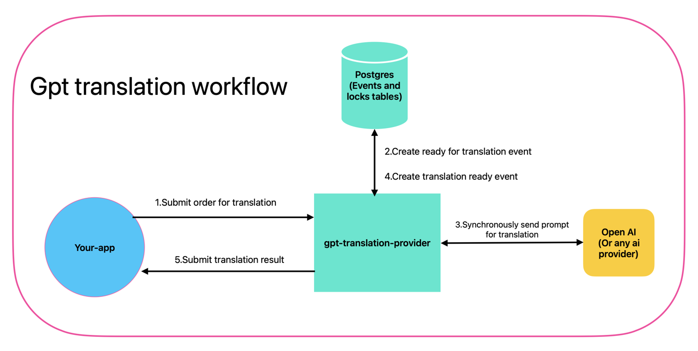
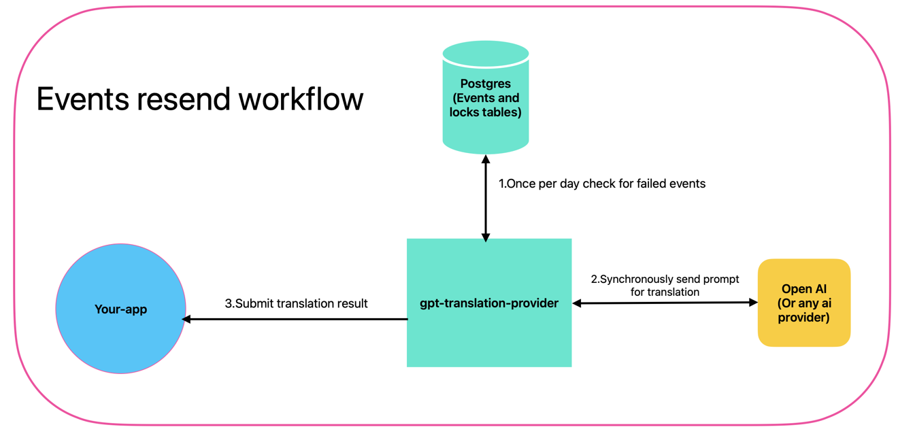
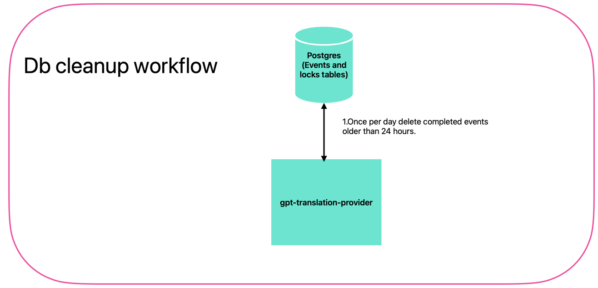

# gpt-translation-provider

## 📚 Documentation

It is a demo project to showcase integration with OpenAI API for translation services.

Please refer to [AGENTS.md](./AGENTS.md) for developer guidelines and repository structure.

Find slides about it here - [gpt-translation-provider.pptx](docs/gpt-translation-provider.pptx)

## Workflow diagrams




## 🚀 Local Development Setup

### Prerequisites

- **Java 21** - The application uses Java 21 features like `var`, switch expressions, and text blocks
- **Maven 3.6+** - For dependency management and building
- **Docker or Podman** - For running PostgreSQL database

### Quick Start

1. **Clone the repository**

2. **Set up the database**<br>
   See [DATABASE.md](./DATABASE.md) for complete setup instructions.

3. **Set up environment variables**
   ```bash
   export OPENAI_API_KEY=your_openai_api_key_here
   ```

4. **Run the application**<br>
Use 'local' profile
   ```bash
   mvn spring-boot:run -Dspring-boot.run.profiles=local
   ```

5. **Verify the setup:**
   - Application: http://localhost:8080
   - Health check: http://localhost:8080/actuator/health

### Technology Stack

- **Spring Boot** - Latest Spring Boot
- **PostgreSQL** - Latest PostgreSQL version
- **Flyway** - Database migration management
- **Spring AI** - OpenAI integration
- **Spring Modulith** - Modular monolith architecture
- **OpenAPI 3** - API documentation

### Database Setup

For complete database setup instructions, connection details, and troubleshooting, see [DATABASE.md](./DATABASE.md).

### Configuration

The application uses Spring profiles for environment-specific configuration:

- **Default profile** (`application.yml`): Uses environment variables for database connection
- **Local profile** (`application-local.yml`): Contains hardcoded values for local development

### Development Commands

```bash
# Build the project
mvn clean compile

# Run tests
mvn test

# Run with local profile (recommended for development)
mvn spring-boot:run -Dspring-boot.run.profiles=local

# Check database migration status
mvn flyway:info -Pflyway-migration \
  -Dflyway.url=jdbc:postgresql://your-host:5432/your-database \
  -Dflyway.user=your-user \
  -Dflyway.password="your-password"

# Apply database migrations manually
mvn flyway:migrate -Pflyway-migration \
  -Dflyway.url=jdbc:postgresql://your-host:5432/your-database \
  -Dflyway.user=your-user \
  -Dflyway.password="your-password"
```

### Troubleshooting

- **Port 5432 already in use:** Stop existing PostgreSQL services or change the port in `docker-compose.yml`
- **OpenAI API errors:** Verify your `OPENAI_API_KEY` environment variable
- **OpenAI connection issues:** Try to run [local_certs.sh](scripts/local_certs.sh) to get proper certificates
- **Database connection issues:** Ensure PostgreSQL container is running with `docker compose ps`

For detailed database troubleshooting, see [DATABASE.md](./DATABASE.md#troubleshooting).

## 🧩 OpenAPI

### Generate OpenAPI documentation

1. Start the application
2. navigate to `http://localhost:8080/v3/api-docs` to see the raw OpenAPI JSON

## Need Help?
Issues in this project are opened for you.
